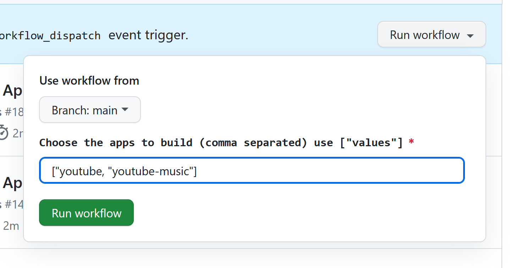

# Revanced Build Scripts


This is a python script that will help you build the ReVanced Android app with no hassle.

- ✅ Build ReVanced with no hassle
- ⚡ Automatically downloads everything you need

## Requirements

- Python 3.6 or higher
- Java 17+ (Recommended: [Zulu](https://www.azul.com/downloads/?package=jdk))

## Usage

- Clone this repository

   ```bash
   git clone https://github.com/ckt1031/revanced-build-script.git
   ```

- Run the script

   ```bash
   pip install -r requirements.txt
   python main.py [app]
   ```

## Arguments

- `app` - The app you want to build. Available options are `youtube`, `youtube-music`, `twitter`, `reddit`, `tiktok`, `twitch`

## How to build with GitHub Actions

1. Go to the Actions tab in your repository.
2. Click on "Run workflow" for the desired workflow.
3. Provide the apps you want to build in the following format: `["youtube", "youtube-music"]`.

   

4. Click on the "Run workflow" button to start the build process.

## Credits

- [ReVanced](https://github.com/revanced) - For making the ReVanced app
